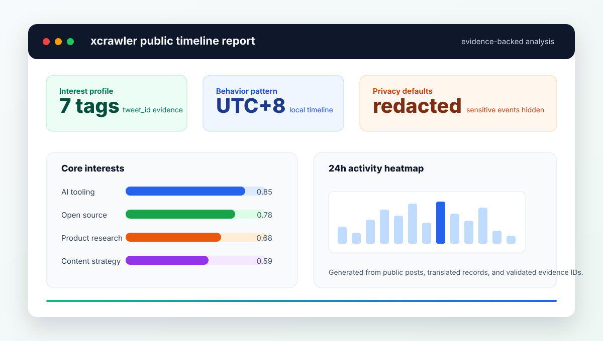

# xcrawler

> Evidence-backed X/Twitter public timeline analysis CLI: fetch public posts, translate multilingual content, and generate interest profiles, behavior patterns, sentiment trends, network signals, and HTML reports.



`xcrawler` 将公开 X/Twitter 时间线转化为可追溯的用户画像与行为洞察。它适合公开账号研究、创作者分析、品牌观察、内容策略和受众洞察；分析结果尽量保留 `tweet_id` 证据，敏感生活事件默认隐藏。

```bash
python3 -m venv .venv
source .venv/bin/activate
python3 -m pip install -e ".[all]"

cp .env.example .env
xcrawler fetch --user target_username --pages 3
xcrawler analyze interest --user target_username
xcrawler report --user target_username
```

## Why xcrawler?

- **Evidence-first analysis**: interest tags and life-event signals are validated against real `tweet_id` evidence.
- **Multilingual workflow**: detects and translates non-Chinese posts before clustering and analysis.
- **Privacy-aware defaults**: sensitive life-event details and evidence are redacted unless explicitly enabled.
- **End-to-end reports**: CLI commands cover fetching, translation, interest profiling, behavior analysis, sentiment, hashtag/mention networks, CSV export, and HTML reports.
- **Local-first storage**: generated JSON, CSV, cache, and reports stay in your local `cache/` directory.

> Responsible use: only analyze public content you are allowed to access. Do not use this project for harassment, stalking, doxxing, discriminatory profiling, or platform-policy violations.

## 🎯 功能特性

### 0. 智能便捷脚本
- ✅ **双模式支持**：`./refetch_data.sh` 支持全量/增量抓取
- ✅ **智能推荐**：低额度用户优先增量抓取，高额度用户按需全量
- ✅ **配置统一**：自动从 `.env` 读取所有配置
- ✅ **兼容旧流程**：保留脚本化使用方式，同时推荐统一 CLI

### 1. 多用户支持
- ✅ 通过 `.env` 配置 `TARGET_USERNAME`
- ✅ 一次配置，所有脚本自动生效
- ✅ 支持同时分析多个用户（数据互不覆盖）
- ✅ 文件命名：`{username}_{类型}.json`

### 2. 数据采集与处理
- ✅ 自动抓取指定用户的推文（排除转发和回复）
- ✅ **智能增量抓取**：自动抓取新发布的推文（Since ID）+ 补全历史（Until ID），双向无缝更新
- ✅ **智能限流处理**：自动检测并等待 API 限流
- ✅ **全语言智能翻译**：自动检测并翻译任意语言（日语/英语/韩语/法语等）→中文（支持缓存）
- ✅ **语言分布统计**：显示推文的语言构成分析
- ✅ 文本清洗和预处理

### 3. 兴趣画像分析
- ✅ **专业版分析** (`analyze_pro.py`)：AI 驱动的深度兴趣画像分析
  - 严格的证据导向分析原则
  - 区分核心兴趣与边缘兴趣
  - 置信度评估和关键词提取
- ✅ **聚类版分析** (`main.py`)：基于向量的主题聚类（K-Means）
- ✅ **快速分析** (`analyze_only.py`)：仅分析现有数据，不重新抓取

### 4. 时间行为分析
- ✅ 24小时发推时间分布
- ✅ 工作日 vs 周末活跃度对比
- ✅ 最活跃时段和星期识别
- ✅ 作息特征分析

### 5. 生活事件检测
- ✅ 自动识别推文中的重要生活事件：
  - 🎂 生日相关
  - 💕 感情状态
  - 🎓 学业/职业变动
  - 🏥 健康事件
  - ✈️ 旅行/搬家
  - 🛒 重大购物
  - 📌 其他重要事件

### 6. 数据可视化
- ✅ **24 小时热力图**：发推时间分布，标注高峰时段
- ✅ **星期分布图**：工作日 vs 周末活跃度对比
- ✅ **语言分布饼图**：推文语言构成一目了然
- ✅ **兴趣标签图**：核心/边缘兴趣置信度横向条形图
- ✅ **HTML 报告**：所有图表汇总为一个可分享的网页

### 7. Hashtag / Mention 网络分析
- ✅ **高频 Hashtag**：提取并统计所有 #标签 使用频率
- ✅ **高频 Mention**：统计 @提及 最多的用户
- ✅ **共现关系**：同一条推文中的 hashtag-mention 配对
- ✅ **可视化图表**：自动生成 hashtag 和 mention 的柱状图
- ✅ **数据回退**：entities 字段为空时自动从文本中提取

### 8. 统一 CLI 与批量翻译
- ✅ **统一 CLI**：所有脚本支持 `--user`、`--pages`、`--model` 等命令行参数
- ✅ **参数覆盖**：CLI 参数优先于 `.env` 配置
- ✅ **参数校验**：非法页数、批大小、温度和 Top N 会在启动时直接报错
- ✅ **执行计划**：抓取、翻译和分析任务会在运行前显示预估页数、批次和 LLM 调用范围
- ✅ **批量翻译**：每批 10 条推文合并为一次 API 调用，费用降低 5-10 倍
- ✅ **自动回退**：批量翻译失败时自动回退到单条翻译


## 📂 项目结构

```
xcrawler/
├── main.py                      # 主程序：数据抓取 + 翻译 + 聚类分析
├── fetch_more_history.py        # 智能增量抓取：双向抓取（新推文 + 历史补全）
├── analyze_pro.py               # 专业分析：AI 驱动的兴趣画像分析
├── analyze_behavior.py          # 行为分析：时间模式 + 生活事件
├── translate_sync.py            # 翻译同步：增量翻译/重翻工具
├── analyze_only.py              # 快速分析：仅兴趣画像（不抓取数据）
├── visualize.py                 # 数据可视化：图表生成
├── analyze_network.py           # Hashtag/Mention 网络分析
├── analyze_sentiment.py         # 情感分析：正/中/负打分 + 趋势图
├── export_csv.py                # CSV 导出：推文/翻译/兴趣导出
├── refetch_data.sh              # 智能抓取脚本：支持全量/增量模式
├── requirements.txt             # 依赖包列表
├── .env                         # 环境变量配置（需自行创建）
├── cache/                       # 缓存目录
│   ├── {username}_raw_tweets.json         # 原始推文
│   ├── {username}_translated.json         # 翻译结果
│   ├── {username}_analysis.json           # 聚类分析结果
│   ├── {username}_interest_profile.json   # 专业兴趣画像
│   ├── {username}_behavior.json           # 行为模式分析
│   ├── {username}_network.json            # Hashtag/Mention 分析
│   ├── {username}_profile.json            # 用户基础信息
│   ├── {username}_sentiment.json          # 情感分析结果
│   ├── {username}_failed.json             # 翻译失败列表（自动重试）
│   ├── charts/{username}_report.html      # 可视化 HTML 报告
│   └── translation_cache.json             # 翻译缓存（通用）
├── cache_backup/                # 备份目录
├── tests/                       # 单元测试
│   └── test_all.py                      # pytest 测试用例
├── CONFIG_GUIDE.md              # 配置指南：多用户配置说明
├── FETCH_MORE_DATA.md           # 增量抓取说明
├── BEHAVIOR_ANALYSIS.md         # 行为分析功能说明
├── QUICK_START.md               # 快速开始指南
├── CONTRIBUTING.md              # 贡献指南
├── SECURITY.md                  # 安全与隐私报告说明
├── RELEASE_CHECKLIST.md         # 发布检查清单
└── ANALYSIS_SUMMARY.md          # 示例分析报告
```

## 🛠️ 便捷脚本详解

### refetch_data.sh - 智能数据抓取脚本

这是保留的便捷脚本，支持两种抓取模式，自动从 `.env` 读取配置；新用户优先使用统一 CLI，已有脚本流程仍可继续使用。

#### 基本使用
```bash
# 查看完整帮助信息
./refetch_data.sh --help

# 全量重新抓取（默认模式）
./refetch_data.sh

# 增量抓取（推荐Free API用户）
./refetch_data.sh --incremental
./refetch_data.sh -i              # 简写形式
```

#### 两种模式详细对比

| 特性 | 全量抓取模式 | 增量抓取模式 |
|------|-------------|-------------|
| **命令** | `./refetch_data.sh` | `./refetch_data.sh -i` |
| **调用脚本** | `main.py` | `fetch_more_history.py` |
| **数据处理** | 备份旧数据，重新抓取 | 保留现有，补充新数据（向前）+ 补全历史（向后） |
| **API消耗** | 高（50页=5000条） | 低（10页=1000条） |
| **适用场景** | 首次使用、重新开始 | 日常更新、Free API |
| **执行时间** | 较长（完整抓取） | 较短（仅补充） |
| **数据安全** | 自动备份到 `cache_backup/` | 直接追加，无备份 |
| **推荐频率** | 按需运行 | 每天一次 |

#### 智能自动化功能
- ✅ **配置自动读取**：从 `.env` 文件自动读取 `TARGET_USERNAME`
- ✅ **依赖检查**：检查缺失的 Python 包，并提示使用虚拟环境安装
- ✅ **数据智能备份**：全量模式下自动备份现有数据到 `cache_backup/`
- ✅ **进度实时显示**：显示抓取进度和API配额使用情况
- ✅ **结果自动验证**：抓取完成后分析数据质量、时间范围和语言分布
- ✅ **后续步骤提示**：自动提供分析脚本的运行建议

#### 典型输出示例

**启动信息：**
```bash
==================================================
🔄 增量抓取数据（续传模式）
==================================================

✅ 从 .env 读取目标用户: MiracleHe

📈 增量模式：保留现有数据，仅补充新数据

⚙️  当前配置:
   模式: 增量抓取（续传）
   MAX_PAGES = 10 (避免API限流)
   TARGET_USERNAME = MiracleHe

🔍 检查依赖...
✅ 依赖已安装
```

**完成统计：**
```bash
📊 新数据统计:
   总推文: 1247条
   时间范围: 2023-08-15 至 2024-12-29
   跨度: 501天

📅 按年份:
   2023年: 156条
   2024年: 891条
   2025年: 200条

📊 语言分布统计:
   英语: 623条 (50%)
   日语: 374条 (30%)
   中文: 187条 (15%)
   其他: 63条 (5%)

✅ 成功获取2024年数据！

🎯 后续步骤:
   1. 运行: python3 analyze_behavior.py  # 重新分析行为
   2. 运行: python3 analyze_only.py      # 重新分析兴趣
   3. 查看: ANALYSIS_SUMMARY.md          # 查看报告

💡 使用说明:
   全量抓取: ./refetch_data.sh
   增量抓取: ./refetch_data.sh --incremental
```

#### 使用策略建议

**低额度 API 用户：**
```bash
# 首次运行（全量抓取）
./refetch_data.sh

# 日常更新（增量抓取）
./refetch_data.sh -i
```

**较高额度 API 用户：**
```bash
# 按需全量抓取（获取完整历史）
./refetch_data.sh

# 快速补充最新数据
./refetch_data.sh -i
```

**🔧 开发测试：**
```bash
# 查看帮助和参数说明
./refetch_data.sh --help

# 测试配置读取
./refetch_data.sh -i  # 低API消耗
```

#### 故障恢复机制
如果全量抓取过程中失败，可以轻松恢复：
```bash
# 恢复备份数据
cp cache_backup/*.json cache/

# 然后尝试增量抓取继续
./refetch_data.sh -i
```

#### 与其他脚本的关系
- **替代关系**：可以替代直接调用 `main.py` 或 `fetch_more_history.py`
- **配置统一**：与所有 Python 脚本共享 `.env` 配置
- **数据兼容**：生成的数据格式与手动运行脚本完全一致
- **分析衔接**：抓取完成后可直接运行分析脚本

### 📋 推荐使用方式总结

根据不同额度和使用场景，以下是推荐实践：

#### 低额度 API 用户（推荐）
```bash
./refetch_data.sh -i    # 日常增量抓取
```
- **优势**：减少 API 消耗，降低触发限流的概率
- **频率**：按需运行
- **适合**：日常数据更新和维护

#### 较高额度 API 用户
```bash
./refetch_data.sh       # 按需运行全量抓取
```
- **优势**：快速获取完整历史数据
- **频率**：按需运行
- **适合**：深度分析和完整数据收集

#### 🚀 首次使用
```bash
./refetch_data.sh       # 全量抓取建立基础数据
```
- **必要性**：建立完整的数据基础
- **后续**：可切换到增量模式维护
- **适合**：所有新用户的第一次运行

#### 🔧 开发测试
```bash
./refetch_data.sh --help  # 查看所有选项
./refetch_data.sh -i      # 低成本测试
```

现在用户可以根据自己的 API 额度和需求选择合适的抓取策略。

## 🚀 快速开始

### 1. 环境准备

项目要求 Python 3.10 或更高版本。

```bash
# 推荐：使用虚拟环境，安装全功能依赖
python3 -m venv .venv
source .venv/bin/activate
python3 -m pip install -e ".[all]"

# 如果只需要基础 CLI / 抓取 / LLM 功能
python3 -m pip install -e .

# 可选依赖：向量聚类/可视化
python3 -m pip install -e ".[ml,viz]"
```

### 2. 配置 API 密钥

从示例文件创建 `.env`，然后填入自己的 API 密钥：

```bash
cp .env.example .env
```

```bash
# Twitter API (用于数据抓取)
X_BEARER_TOKEN=your_twitter_bearer_token

# DeepSeek API (用于翻译和AI分析)
DEEPSEEK_API_KEY=your_deepseek_api_key

# 目标用户名（可修改为任意 X 用户名）
TARGET_USERNAME=MiracleHe

# 增量抓取目标日期（格式：YYYY-MM-DD，抓取到此日期或最早推文为止）
TARGET_DATE=2024-01-01

# 时区偏移（UTC+N），默认 8（中国）
TIMEZONE_OFFSET=8

# DeepSeek API 配置 (可选，默认值如下)
DEEPSEEK_BASE_URL=https://api.deepseek.com
LLM_MODEL=deepseek-chat
```

**获取方式：**
- Twitter API Token: https://developer.twitter.com/
- DeepSeek API Key: https://platform.deepseek.com/

**多用户分析：**
- 修改 `.env` 中的 `TARGET_USERNAME` 即可切换用户
- 详见 [CONFIG_GUIDE.md](CONFIG_GUIDE.md)

### 3. 运行分析

#### 🌟 推荐方式：使用统一 CLI

安装完成后可以直接使用 `xcrawler` 命令：

```bash
# 首次完整流程：抓取 + 翻译 + 聚类
xcrawler fetch --user MiracleHe

# 专业兴趣画像
xcrawler analyze interest --user MiracleHe

# 行为分析（默认隐藏敏感生活事件）
xcrawler analyze behavior --user MiracleHe

# 生成图表和 HTML 报告
xcrawler report --user MiracleHe
```

旧脚本入口仍然保留，例如 `python3 main.py`、`python3 analyze_pro.py`，用于兼容已有流程。

#### 方案 A：首次完整分析

```bash
# Step 1: 抓取数据 + 翻译 + 聚类分析
xcrawler fetch

# Step 2: 专业兴趣画像分析（推荐）
xcrawler analyze interest

# Step 3: 行为分析（时间模式 + 生活事件）
xcrawler analyze behavior
```

#### 方案 B：增量抓取（推荐 Free API）

```bash
# 首次抓取
xcrawler fetch

# 智能增量抓取（自动抓取最新 + 抓取到2024年1月1日历史）
xcrawler fetch-more

# 确保新数据被翻译（关键步骤）
xcrawler translate

# 或使用便捷脚本（已包含同步逻辑）
./refetch_data.sh --incremental    # 增量抓取（推荐）
./refetch_data.sh                  # 全量重新抓取

# 重新分析
xcrawler analyze interest
xcrawler analyze behavior
```

#### 方案 C：仅分析现有数据

```bash
# 快速分析（不重新抓取）
python3 analyze_only.py      # 聚类分析
xcrawler analyze interest    # 专业分析
xcrawler analyze behavior    # 行为分析
```

### 4. 统一 CLI 命令

`xcrawler` 支持统一子命令，CLI 参数优先于 `.env` 配置：

```bash
# 指定用户和抓取页数
xcrawler fetch -u MiracleHe --pages 10

# 限制后续聚类/画像最多分析的翻译推文数，避免大数据集过慢
xcrawler fetch -u MiracleHe --pages 10 --analysis-limit 500

# 指定用户和模型
xcrawler analyze interest -u MiracleHe --model deepseek-chat --limit 300

# 增量抓取指定用户和目标日期
xcrawler fetch-more -u MiracleHe --target-date 2023-01-01

# 查看帮助
xcrawler --help
xcrawler analyze --help
```

#### 常用子命令

| 命令 | 说明 |
|------|------|
| `xcrawler fetch` | 抓取数据、翻译并执行聚类分析 |
| `xcrawler fetch-more` | 智能增量抓取新推文和历史推文 |
| `xcrawler translate` | 同步或重翻已有原始推文 |
| `xcrawler analyze interest` | 专业兴趣画像分析 |
| `xcrawler analyze behavior` | 时间行为和生活事件分析 |
| `xcrawler analyze sentiment` | 情感分析 |
| `xcrawler analyze network` | Hashtag / Mention 网络分析 |
| `xcrawler report` | 生成图表和 HTML 报告 |
| `xcrawler export csv` | 导出 CSV |

#### 兼容脚本支持的参数

| 参数 | 说明 | main.py | fetch | analyze_pro | behavior | only |
|------|------|:-------:|:-----:|:-----------:|:--------:|:----:|
| `-u/--user` | 目标用户名 | ✅ | ✅ | ✅ | ✅ | ✅ |
| `--pages` | 抓取页数 | ✅ | ✅ | - | - | - |
| `--model` | LLM 模型名 | ✅ | - | ✅ | - | - |
| `--batch-size` | 每批翻译条数 | ✅ | - | - | - | - |
| `--analysis-limit` | 聚类和画像最多分析的翻译推文数 | ✅ | - | - | - | - |
| `--target-date` | 历史目标日期 | - | ✅ | - | - | - |
| `--cache-dir` | 缓存目录 | ✅ | ✅ | ✅ | ✅ | ✅ |
| `--temperature` | 模型温度 | - | - | ✅ | - | - |
| `--limit` | 兴趣画像最多分析的翻译文本数 | - | - | ✅ | - | - |
| `--no-translate` | 仅抓取不翻译 | ✅ | - | - | - | - |

CLI 会校验关键数值参数：`pages >= 1`、`batch-size >= 1`、`analysis-limit >= 1`、`limit >= 1`、`top >= 1`、`interval >= 0`、`0 <= temperature <= 2`。

### 5. 数据可视化

```bash
# 生成所有图表 + HTML 报告
xcrawler report

# 指定用户
xcrawler report -u MiracleHe

# 自定义输出目录
xcrawler report --output ./my_charts

# 如确需展示敏感生活事件证据，必须显式开启
xcrawler report --include-sensitive-events
```

输出文件（默认在 `cache/charts/`）：
- `{username}_hourly.png` - 24 小时发推热力图
- `{username}_weekday.png` - 星期分布图
- `{username}_language.png` - 语言分布饼图
- `{username}_interests.png` - 兴趣标签图
- `{username}_report.html` - 汇总 HTML 报告，包含兴趣画像和生活事件的 evidence tweet 证据区

默认情况下，HTML 报告会隐藏敏感生活事件证据；仅在显式传入 `--include-sensitive-events` 时展示。

### 6. Hashtag / Mention 网络分析

```bash
# 分析 hashtag 和 mention
xcrawler analyze network

# 指定用户，显示 Top 30
xcrawler analyze network -u MiracleHe --top 30
```

输出：
- 终端打印 Top N hashtag/mention 频率
- `cache/charts/{username}_hashtags.png` - Hashtag 柱状图
- `cache/charts/{username}_mentions.png` - Mention 柱状图
- `cache/{username}_network.json` - 完整分析数据

### 7. 情感分析

```bash
# 对翻译后的推文做情感打分
xcrawler analyze sentiment

# 指定用户
xcrawler analyze sentiment -u MiracleHe --top 10
```

输出：
- `cache/charts/{username}_sentiment.png` - 情感时间趋势图
- `cache/charts/{username}_sentiment_pie.png` - 情感分布饼图
- `cache/{username}_sentiment.json` - 情感分析数据

如果某个 LLM 批次调用失败或响应无法解析，对应推文会标记为 `unknown`，不会被误计为 `neutral`。

### 8. CSV 导出

```bash
# 导出所有数据为 CSV
xcrawler export csv

# 只导出翻译数据
xcrawler export csv --type translations

# 指定用户和输出目录
xcrawler export csv -u MiracleHe --output ./my_data
```

输出文件（默认在 `cache/csv/`）：
- `{username}_tweets.csv` - 原始推文（含 hashtag/mention 列）
- `{username}_translations.csv` - 原文 + 翻译 + 语言
- `{username}_interests.csv` - 兴趣标签 + 置信度

## 🌐 多语言翻译功能

### 支持的语言
- 🌍 **任意语言** → 中文（自动检测 + 智能翻译）
- 🇨🇳 **中文** → 直接保留（跳过翻译）

### 智能特性
- ✅ **批量翻译**：每批 10 条推文合并为一次 API 调用，费用降低 5-10 倍
- ✅ **自动语言检测**：使用 `langdetect` 库自动识别推文语言
- ✅ **智能翻译策略**：根据检测语言使用不同的翻译提示词
- ✅ **语言分布统计**：显示推文的语言构成分析
- ✅ **翻译缓存机制**：避免重复翻译，节省 API 调用
- ✅ **网络用语适配**：针对不同语言的网络用语和梗进行本地化翻译

### 输出示例

#### 语言分布统计
```
📊 语言分布统计:
   英语: 45 条 (45%)
   日语: 23 条 (23%)
   中文: 12 条 (12%)
   韩语: 8 条 (8%)
   未知: 3 条 (3%)
```

#### 翻译数据格式
```json
{
  "tweet_id": "1740000000000000000",
  "original": "Hello world! This is my first tweet!",
  "translated": "你好世界！这是我的第一条推文！",
  "detected_language": "en",
  "created_at": "2024-01-01T12:00:00.000Z"
}
```

### 翻译质量优化
- **技术术语保留**：保持专业术语的准确性
- **语气风格保持**：保留原文的情感色彩和语气
- **网络用语本地化**：将英语/日语网络梗翻译为对应的中文网络用语
- **上下文理解**：基于推文特点进行语境化翻译

### 独立翻译同步工具 (`translate_sync.py`)

用于在不重新抓取数据的情况下，同步或重新翻译推文。

```bash
# 1. 增量同步（默认）
# 仅翻译 _raw_tweets.json 中尚未翻译的推文
python3 translate_sync.py

# 2. 强制重翻（--force）
# 忽略缓存，强制重新翻译所有推文（用于修复翻译或语言检测问题）
python3 translate_sync.py --force
```


## 📊 输出示例

### 专业兴趣画像（analyze_pro.py）

```json
{
  "interests": [
    {
      "tag": "游戏娱乐",
      "level": "core",
      "confidence": 0.85,
      "keywords": ["手游", "抽卡", "排位", "游戏"],
      "evidence_count": 28,
      "evidence_tweet_ids": ["1740000000000000000", "1740000000000000001"]
    },
    {
      "tag": "美妆护肤",
      "level": "core",
      "confidence": 0.78,
      "keywords": ["韩系妆容", "护肤品", "美妆"],
      "evidence_count": 22,
      "evidence_tweet_ids": ["1740000000000000002"]
    },
    {
      "tag": "餐饮工作",
      "level": "core",
      "confidence": 0.82,
      "keywords": ["日本料理", "服装店", "工作"],
      "evidence_count": 15,
      "evidence_tweet_ids": ["1740000000000000003"]
    },
    {
      "tag": "音乐订阅",
      "level": "peripheral",
      "confidence": 0.45,
      "keywords": ["Spotify", "Apple Music"],
      "evidence_count": 8,
      "evidence_tweet_ids": ["1740000000000000004"]
    }
  ]
}
```

**特点：**
- ✅ 严格的证据导向（多次出现才识别）
- ✅ 置信度量化（0~1）
- ✅ 核心/边缘兴趣区分
- ✅ 关键词提取

### 行为分析报告（analyze_behavior.py）

```
⏰ 时间行为分析
============================================================

📊 总推文数: 100
📅 工作日 vs 周末: 84 vs 16 (5.25:1)

🕐 最活跃时段（UTC+8）:
   12:00 - 9条推文  ← 午休高峰
   11:00 - 8条推文
   20:00 - 8条推文  ← 晚间高峰

📆 最活跃星期:
   周五 - 24条 (24%)  ← 周五综合症
   周四 - 20条 (20%)
   周一 - 18条 (18%)

⏱️ 时段分布:
   深夜 (0-6点): 16条 (16.0%)  ← 夜猫子倾向
   早晨 (6-9点): 8条 (8.0%)    ← 起床较晚
   上午 (9-12点): 21条 (21.0%)
   下午 (12-18点): 26条 (26.0%)
   晚上 (18-24点): 29条 (29.0%)  ← 最活跃

🎉 生活事件检测
============================================================

🎓 学业/职业:
   • 被拜托帮忙服装店开业（2025-12-15）
   • 在日本料理店工作（2025-11-30）

🏥 健康相关:
   • [敏感生活事件已隐藏]

🛒 重大购物:
   • Delonghi咖啡机（2025-12-26）
   • 美妆产品（2025-11-15）
   • 森海塞尔Momentum 4耳机（想要）

🎨 行为特征总结
============================================================

1. 作息特征
   夜间型用户，晚上最活跃，早晨活动少。

2. 活跃模式
   工作日高频使用，周末减少，午休和晚间是高峰。

3. 生活状态
   餐饮从业者，关注美妆、游戏、宠物，有经济压力。
```

## 🎛️ 配置选项

### 统一配置（推荐）

**所有脚本都从 `.env` 读取配置：**

```bash
# .env
TARGET_USERNAME=MiracleHe     # 目标用户名（一次配置，全局生效）
TARGET_DATE=2024-01-01        # 增量抓取目标日期（可自定义历史范围）
```

### 脚本内部配置

#### main.py
```python
TARGET_USERNAME = os.getenv("TARGET_USERNAME", "MiracleHe")  # 从环境变量读取
MAX_PAGES = 50                 # 抓取页数（每页100条）
MAX_RETRIES = 3                # API重试次数
CACHE_DIR = "cache"            # 缓存目录
```

#### fetch_more_history.py
```python
TARGET_USERNAME = os.getenv("TARGET_USERNAME", "MiracleHe")  # 从环境变量读取
MAX_PAGES = 10                 # Free API：每天10页，避免限流
TARGET_DATE = os.getenv("TARGET_DATE", "2024-01-01")  # 目标日期：从环境变量读取
REQUEST_INTERVAL = 3           # 请求间隔（秒）
```

**智能抓取逻辑**：
- 从 `.env` 文件读取 `TARGET_DATE`（默认：2024-01-01）
- 如果最早推文 ≤ 目标日期：停止抓取（已有足够历史数据）
- 如果最早推文 > 目标日期：继续抓取到目标日期或最早推文

#### analyze_pro.py
```python
TARGET_USERNAME = os.getenv("TARGET_USERNAME", "MiracleHe")  # 从环境变量读取
MODEL = os.getenv("LLM_MODEL", "deepseek-chat")          # LLM 模型
```

#### analyze_behavior.py
```python
TARGET_USERNAME = os.getenv("TARGET_USERNAME", "MiracleHe")  # 从环境变量读取
CACHE_DIR = "cache"            # 缓存目录
TIMEZONE_OFFSET = 8            # 时区偏移（UTC+N），默认8（中国）
```

**多用户配置详见：** [CONFIG_GUIDE.md](CONFIG_GUIDE.md)

## 📋 依赖说明

### 必需依赖
```
requests>=2.31.0           # HTTP 请求
tqdm>=4.66.0               # 进度条
openai>=1.0.0             # DeepSeek API 调用
python-dotenv>=1.0.0      # 环境变量管理
langdetect>=1.0.9         # 语言检测（多语言翻译支持）
```

### 向量聚类依赖（`.[ml]`）
```
sentence-transformers>=2.2.0  # 文本向量化
scikit-learn>=1.3.0          # 聚类算法
transformers>=4.35.0
torch>=2.0.0
huggingface-hub>=0.19.0
```

### 可视化依赖（`.[viz]`）
```
matplotlib>=3.7.0            # 数据可视化图表
```

### 测试依赖
```
pytest>=7.0.0               # 单元测试框架（可选）
```

## 🛠️ 便捷脚本使用

### refetch_data.sh - 智能数据抓取脚本

这个脚本支持两种抓取模式，自动从 `.env` 读取配置：

#### 使用方法
```bash
# 查看帮助
./refetch_data.sh --help

# 全量重新抓取（默认模式）
./refetch_data.sh

# 增量抓取（推荐Free API用户）
./refetch_data.sh --incremental
./refetch_data.sh -i              # 简写
```

#### 模式对比

| 模式 | 命令 | 适用场景 | 数据处理 | API消耗 |
|------|------|----------|----------|---------|
| **全量抓取** | `./refetch_data.sh` | 首次使用、重新开始 | 备份旧数据，重新抓取 | 高（50页） |
| **增量抓取** | `./refetch_data.sh -i` | 日常更新、Free API | 保留现有，补充新发布（向前）+ 补全历史（向后） | 低（10页） |

#### 自动功能
- ✅ 从 `.env` 自动读取 `TARGET_USERNAME`
- ✅ 自动检查依赖包并提示安全安装方式
- ✅ 智能备份现有数据（全量模式）
- ✅ 数据统计和验证
- ✅ 后续分析步骤提示

## 🔍 使用场景

### 1. 市场营销
- **目标用户画像**：了解潜在客户的兴趣和行为
- **最佳触达时间**：根据活跃时段优化投放
- **内容策略**：基于兴趣主题定制内容

### 2. 竞品分析
- **竞争对手分析**：了解竞品的目标用户群体
- **行业趋势**：通过多用户分析发现行业趋势

### 3. 社交媒体研究
- **用户行为研究**：分析社交媒体使用模式
- **内容传播**：研究不同类型内容的传播效果

### 4. 个人应用
- **自我认知**：分析自己的推文了解行为模式
- **时间管理**：优化社交媒体使用时间

## ⚠️ 注意事项

### API 限制
- **X/Twitter API**: 不同套餐的读取额度和限流规则会变化，请以 X Developer Portal 当前说明为准
  - 推荐先用较小页数测试，例如 `xcrawler fetch --pages 3`
  - 日常更新优先使用 `xcrawler fetch-more` 或 `./refetch_data.sh -i`
  - 脚本会读取限流重置时间并自动等待
- **DeepSeek API**: 翻译和分析会消耗 API 额度
- **建议**: 
  - 使用翻译缓存机制减少重复调用
  - **低额度用户**：优先增量抓取，并降低 `--pages`
  - **高额度用户**：按需全量抓取
  - **首次使用**：先小页数验证配置，再逐步扩大抓取范围

### 隐私保护
- ⚠️ 仅用于公开推文分析
- ⚠️ 遵守 Twitter 使用条款
- ⚠️ 尊重用户隐私，谨慎使用分析结果

### 数据准确性
- 分析基于用户**公开的原创推文**（排除转发和回复）
- AI 事件检测可能存在误判，建议人工复核
- 时间分析基于推文时间戳，假设用户在特定时区

## 🐛 故障排除

### 问题1: "ModuleNotFoundError: No module named 'langdetect'"
```bash
# 建议先启用虚拟环境，再安装语言检测库（注意使用引号）
python3 -m pip install "langdetect>=1.0.9"

# 或安装所有依赖
python3 -m pip install -e ".[all]"
```

### 问题2: "zsh: 1.0.9 not found"
这是 shell 解析问题，使用引号包围版本号：
```bash
pip3 install "langdetect>=1.0.9"
```

### 问题3: "ModuleNotFoundError: No module named 'XXX'"
```bash
# 安装所有依赖
python3 -m pip install -e ".[all]"

# 或仅安装必需依赖
python3 -m pip install -e .
```

### 问题4: "找不到数据文件"
先运行 `main.py` 抓取数据，再运行其他分析脚本。

### 问题5: "API 限流（429）"
不同 X/Twitter API 套餐限流不同：
- 推荐先运行 `xcrawler fetch --pages 3` 验证配置
- 日常更新使用 `xcrawler fetch-more` 或 `./refetch_data.sh -i`
- 脚本会尽量根据接口返回的限流重置时间等待
- 也可以手动降低 `--pages`

### 问题6: "便捷脚本权限错误"
```bash
# 给脚本添加执行权限
chmod +x refetch_data.sh

# 然后正常运行
./refetch_data.sh -i
```

### 问题7: "翻译失败"
检查 `.env` 文件中的 `DEEPSEEK_API_KEY` 是否正确。

### 问题8: "语言检测不准确"
- 短文本（<3个字符）会被标记为"未知"
- 包含大量链接和@符号的推文可能影响检测准确性
- 混合语言推文以主要语言为准

### 问题9: "聚类错误"
确保有足够的推文（至少10条）进行有效分析。

### 问题10: "文件名包含用户名"
这是正常设计，支持多用户分析：
- 修改 `.env` 中的 `TARGET_USERNAME` 即可切换用户
- 详见 [CONFIG_GUIDE.md](CONFIG_GUIDE.md)

## 🧪 运行测试

项目包含 94 个单元测试，使用 pytest 运行：

```bash
# 安装测试依赖（推荐）
python3 -m pip install -e ".[test]"

# 运行所有测试
python3 -m pytest

# 运行特定测试类
python3 -m pytest tests/test_all.py::TestCleanText -v

# 查看测试覆盖率概览
python3 -m pytest tests/test_all.py --tb=short
```

### 测试覆盖范围

| 测试类 | 数量 | 覆盖内容 |
|--------|------|----------|
| TestCleanText | 7 | 文本清洗（URL/@/空白） |
| TestParseBatchResponse | 6 | 批量翻译响应解析 |
| TestDetectLanguage | 4 | 语言检测 + 容错 |
| TestTranslationCache | 3 | 缓存读写/损坏恢复 |
| TestDeepseekTranslate | 5 | 单条翻译 + mock API |
| TestDeepseekTranslateBatch | 4 | 批量翻译 + mock API + 批大小保护 |
| TestClusterCalculation | 4 | 聚类数动态计算 |
| TestParseTwitterDatetime | 3 | 时间戳解析容错 |
| TestParseDt | 2 | 可视化时间解析 |
| TestExtractEntities | 4 | Hashtag/Mention 提取 |
| TestExtractHashtagsFromText | 3 | 文本 Hashtag 提取 |
| TestGetUserId | 2 | 用户 ID 获取 (mock) |
| TestGetUserProfile | 2 | 用户信息获取 (mock) |
| TestTranslateSyncImport | 1 | Import 不崩溃 |
| TestExportCsvHelpers | 2 | CSV 导出 |
| TestXcrawlerTextUtils | 2 | 公共文本工具 |
| TestXcrawlerTimeUtils | 1 | 公共时间工具 |
| TestJsonStore | 3 | 公共 JSON 读写和 append |
| TestConfig | 1 | 公共配置覆盖 |
| TestModels | 2 | 核心数据模型 |
| TestTranslationRecords | 2 | 翻译记录兼容层 |
| TestEvidenceService | 4 | evidence id 校验与 HTML 渲染 |
| TestPrivacyGuard | 3 | 敏感事件识别与脱敏 |
| TestCli | 8 | 统一 CLI 参数解析、校验和转发 |
| TestAnalysisRuns | 2 | 分析运行记录与成功/失败状态 |
| TestSentimentFailures | 2 | 情感分析失败不污染 neutral + token 统计 |
| TestFetchPlan | 1 | 抓取请求量预估 |
| TestLLMProvider | 2 | LLM Provider 响应封装 |
| TestVisualizeEvidence | 2 | HTML 报告证据区与敏感证据隐藏 |
| TestTranslationService | 3 | 公共翻译服务与 usage metrics |
| TestXApiClient | 1 | 公共 X API client |

## 🧱 模块化结构

项目保留 `main.py`、`fetch_more_history.py`、`analyze_*.py` 等旧脚本入口，同时逐步把可复用能力沉到 `xcrawler/` 包中：

```text
xcrawler/
├── cli.py                 # 统一 xcrawler 命令入口
├── config.py              # .env 配置读取与通用覆盖
├── models.py              # TweetRecord / TranslatedTweet / 分析结果模型
├── paths.py               # cache 路径与目录创建
├── clients/
│   ├── llm.py             # OpenAI/DeepSeek 兼容客户端
│   └── x_api.py           # X API 用户与推文接口
├── llm/
│   └── provider.py        # LLMProvider / DeepSeekProvider 抽象
├── services/
│   ├── analysis_runs.py   # 分析运行记录
│   ├── fetch_plan.py      # 抓取请求量预估
│   ├── records.py         # translated.json 新旧格式兼容
│   └── translation.py     # 单条/批量翻译与响应解析
├── storage/
│   ├── base.py            # Storage 接口
│   └── json_store.py      # JSON 读写与目录创建
└── utils/
    ├── cli_validation.py  # CLI 数值参数校验
    ├── text.py            # 文本清洗与语言检测
    └── time.py            # Twitter 时间解析
```

`xcrawler` 是当前推荐入口；旧脚本仍然保留，作为兼容已有流程的 legacy 入口。

### 存储与 Provider

当前默认存储仍然是 JSON 文件，适合个人、小规模、低频分析；`JsonStore` 在此基础上提供统一接口，并可记录 `analysis_runs.json` 运行元数据，包括用户、分析类型、模型、参数、输入范围、开始/完成时间、运行状态、耗时、LLM 调用次数、token 用量、失败类型和失败批次。主抓取流程的翻译阶段会在 `{username}_analysis.json` 的 `stats` 中记录翻译 LLM 调用次数、token 用量和失败批次。后续如果需要长期、多用户、多次增量分析，可在 `Storage` 接口下增加 SQLite Store，用于查询运行历史、模型参数和结果版本。

LLM 调用通过 `LLMProvider` 抽象保留 DeepSeek/OpenAI 兼容 Provider 入口。兴趣、行为和情感分析已接入 Provider，可记录 provider、模型、token 用量和 latency；翻译批处理仍保留专用路径，但已补充执行计划、缓存、失败列表、批大小校验和 usage metrics。

## 🔄 更新日志

### v0.3.0 - 工程化封装与开源产品化 🆕
- ✅ **工程地基**：补齐 `pyproject.toml`、`.env.example`、CI、LICENSE 和测试配置，支持标准包安装
- ✅ **模块化封装**：抽出 config、paths、storage、clients、services、utils 等公共模块，旧脚本保持兼容
- ✅ **统一 CLI**：新增 `xcrawler fetch/translate/analyze/report/export` 入口，README 以统一 CLI 为主路径
- ✅ **慢任务保护**：新增参数校验、执行计划、`--analysis-limit` 和兴趣分析 `--limit`
- ✅ **证据追溯**：保留 `tweet_id`，兴趣画像和报告支持 `evidence_tweet_ids`
- ✅ **隐私保护**：敏感生活事件默认隐藏，HTML 报告证据原文默认脱敏
- ✅ **运行记录**：新增 `analysis_runs.json`，关联分析结果、模型、参数、输入范围、时间、状态、耗时、token 和失败批次
- ✅ **Provider 与存储抽象**：新增 `Storage`、`JsonStore`、`LLMProvider`、DeepSeek/OpenAI 兼容 Provider
- ✅ **开源协作**：新增 `CONTRIBUTING.md`、`SECURITY.md`、`RELEASE_CHECKLIST.md`

### v0.2.0 - 用户画像增强、可视化与数据导出
- ✅ **用户信息抓取**：自动获取目标用户的 bio、粉丝数、关注数等基础信息
- ✅ **情感分析**：新增 `analyze_sentiment.py`，批量正/中/负打分，生成趋势图和饼图
- ✅ **CSV 导出**：新增 `export_csv.py`，推文、翻译和兴趣一键导出为 CSV
- ✅ **批量翻译**：每批多条推文合并为一次 API 调用，降低重复调用成本
- ✅ **数据可视化**：新增 `visualize.py`，生成 24 小时热力图、语言分布饼图、兴趣标签图和 HTML 报告
- ✅ **网络分析**：新增 `analyze_network.py`，提取高频 hashtag、@mention 和共现关系
- ✅ **翻译同步**：新增 `translate_sync.py`，支持增量翻译、强制重翻和失败重试
- ✅ **代码质量**：改进配置、时区、异常处理、缓存保护、解析容错和延迟加载

### v0.1.0 - 多语言抓取与分析脚本阶段
- ✅ **专业兴趣画像**：新增 `analyze_pro.py`，支持 AI 驱动的兴趣画像分析
- ✅ **行为分析**：新增 `analyze_behavior.py`，支持时间模式和生活事件检测
- ✅ **增量抓取**：新增 `fetch_more_history.py` 和 `refetch_data.sh`，支持新推文抓取与历史补全
- ✅ **多语言翻译**：支持自动语言检测、中文跳过、任意语言到中文翻译和翻译缓存
- ✅ **多用户配置**：通过 `.env` 中的 `TARGET_USERNAME` 和 `TARGET_DATE` 切换目标用户与历史范围

### 早期脚本阶段
- 建立 `main.py` 抓取、翻译、聚类分析主流程
- 建立本地 JSON 缓存格式和基础分析报告输出
- 补充 README、配置指南、增量抓取说明和行为分析说明

## 📚 相关文档

- [CONFIG_GUIDE.md](CONFIG_GUIDE.md) - 配置指南：多用户分析配置
- [QUICK_START.md](QUICK_START.md) - 快速开始指南
- [FETCH_MORE_DATA.md](FETCH_MORE_DATA.md) - 增量抓取说明
- [BEHAVIOR_ANALYSIS.md](BEHAVIOR_ANALYSIS.md) - 行为分析功能说明
- [CONTRIBUTING.md](CONTRIBUTING.md) - 贡献指南：开发环境、PR 流程、测试要求
- [SECURITY.md](SECURITY.md) - 安全与隐私报告说明
- [RELEASE_CHECKLIST.md](RELEASE_CHECKLIST.md) - 发布前检查清单
- [ANALYSIS_SUMMARY.md](ANALYSIS_SUMMARY.md) - 完整的用户分析报告示例

## 🤝 贡献

欢迎提交 Issue 和 Pull Request。建议先阅读 [CONTRIBUTING.md](CONTRIBUTING.md)，其中包含开发环境、测试命令、PR 描述和隐私默认值要求。

如果你发现密钥泄露、缓存数据暴露、敏感事件未脱敏等安全或隐私问题，请参考 [SECURITY.md](SECURITY.md) 私下报告，不要直接公开可利用细节。

## 🔐 Privacy / Responsible Use

本项目仅应分析公开内容，并用于学习、研究、个人内容复盘或获得授权的社媒分析。请勿用于骚扰、跟踪、人肉搜索、歧视性画像、平台外广告定向、获取非公开个人信息或其他违背用户合理隐私预期的用途。

隐私保护默认行为：

- `analyze_behavior.py` 默认隐藏敏感生活事件详情和证据 tweet id。
- 如确需完整敏感事件证据，必须显式传入 `--include-sensitive-events`。
- `visualize.py` 生成 HTML 报告时默认隐藏敏感事件证据原文。
- 邮箱、电话号码、地址类文本会在报告证据中做基础脱敏。

数据清理：

```bash
# 删除默认缓存数据
rm -rf cache/

# 删除备份数据
rm -rf cache_backup/

# 删除某个用户的缓存文件
rm -f cache/{username}_*.json cache/charts/{username}_*
```

## 📄 许可证

MIT License

---

**免责声明**: 本工具仅供学习和研究使用，请遵守相关法律法规和平台使用条款，尊重用户隐私。
